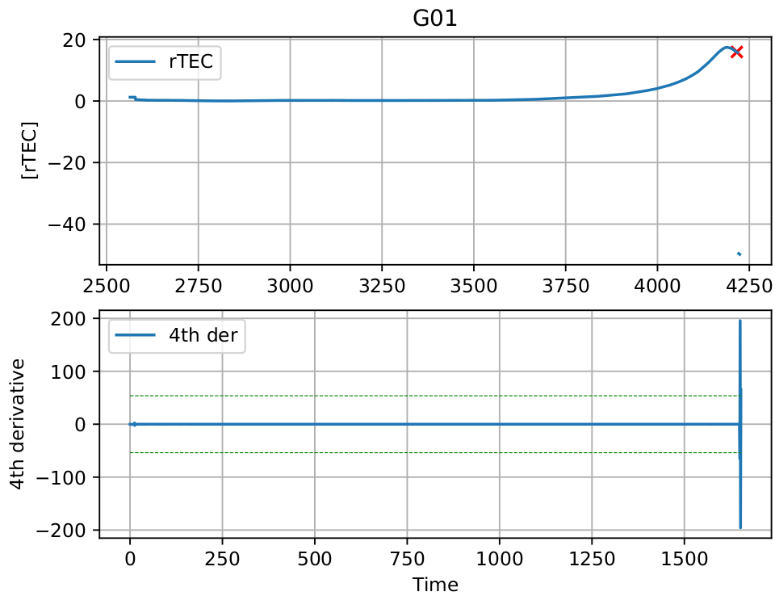
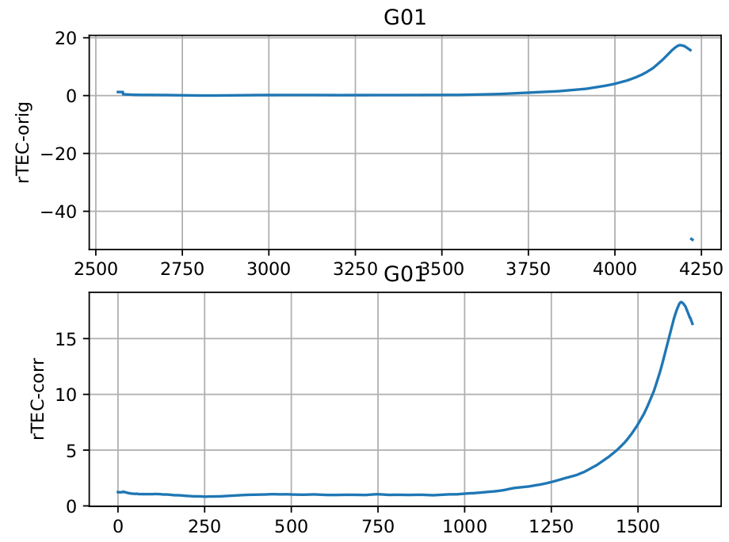

# GNSS Cycle-Slip Correction
Aplicação [Python](https://www.python.org/) para análise e correção perda de ciclos (_cycle-slip_) presentes em 
dados GNSS (rinex). 

#### Introdução
O posicionamento com GPS está sujeito a várias fontes de erros com origens tanto nos satélites, quanto nos receptores, como também na propagação do sinal
entre o satélite e o receptor. É um assunto amplamente discutido por vários autores e entre eles, cita-se, por exemplo: Monico (2008); Seeber (2003). Tais erros devem
ser considerados no processo de ajustamento para se possa obter uma correta resolução das ambigüidades da fase, e conseqüentemente um posicionamento com
alta acurácia, alcançando poucos milímetros. 

Em linhas de base curtas, o posicionamento relativo com receptores de apenas uma frequência (portadora L1 e código C/A) tem sido uma estratégia muito
utilizada para atenuar os erros comuns às estações envolvidas. Porém, o multicaminho e as perdas de ciclos não são reduzidos no posicionamento relativo,
pois dependem de condições particulares de cada estação. Portanto, esses tipos de erros devem receber tratamento específico. Neste artigo os esforços serão
direcionados para o tratamento das perdas de ciclos.

[...]

Mônico, J. F. G. et al. **AVALIAÇÃO DE ESTRATÉGIAS DE DETECÇÃO E CORREÇÃO DE PERDAS DE CICLOS NA PORTADORA GPS L1**. Bol. Ciênc. Geod., sec. Artigos, Curitiba, v. 15, no 2, p.178-193, abr-jun, 2009.

Exemplo de detecção realizada pelo algoritmo:



Gráficos do PRN G01, antes e depois da correção:



***

#### Contribuidores envolvidos
###### Departamento de Ciências Espaciais e Atmosféricas (CEA-II) - INPE
Dr. Cristiano Max Wrasse (Pesquisador) [_cristiano.wrasse@inpe.br_]  
Dr. Cosme A. O. B. Figueiredo [_cosme.figueiredo@inpe.br_]  

###### Desenvolvimento - EMBRACE/INPE
Dr. Rodolfo G. Lotte [_rodolfo.lotte@inpe.br_]  
Silvio Leite [silvio.leite@inpe.br]  
MSc. David G. M. França [david.franca@inpe.br]  

***

#### Ambiente de desenvolvimento:

Após clonar o repositório [git](https://github.com/embrace-inpe/cycle-slip-correction) para um diretório em sua máquina, 
siga as instruções à seguir para executar o programa.

1. [Ambiente virtual Python `.venv`](#1-Criar-ambiente-Python-isolado-com-a-lib-virtualenv)
2. [Instalação de dependências `pip`](#2-Instalando-dependncias)
3. [Versões do `RINEX`](#3-Verses-do-rinex)
4. [Configurando constantes](#4-Configurando-constantes)
5. [Execução do programa `main.py`](#5-Execuo-do-programa)
6. [Performance](#6-Performance)
7. [Como contribuir com o projeto?](#7-Como-contribuir-com-o-projeto)

#### 1. Criar ambiente Python isolado com a lib virtualenv
Navegar até o diretório `cycle-slip-correction/` e criar o ambiente isolado através do comando:

```console
$ python -m venv .venv
```

Para ativar a venv basta executar o comando: 

```console
$ source .venv/bin/activate
```
Se tudo correr bem o prefixo da máquina virtual deve aparecer no seu  console da seguinte forma:
```console
(.venv) usuario@maquina:<seu-diretorio>$ seus comandos aqui
```
Para desativar a venv e retornar ao ambiente padrão, execute o comando: 

```console
$ deactivate
```
#### 2. Instalando dependências
Dentro da pasta do projeto `cycle-slip-correction/` e com a venv ativada, execute o comando:

```console
$ pip install -r requirements.txt
```

#### 3. Versões do rinex
O atual código garante análise e correção de _cycle-slip_ em arquivos `RINEX` de `3.01` a `3.03`.

#### 4. Configurando constantes
As constantes são definidas em `settings.py` e podem ser alteradas de acordo com a necessidade da análise, 
por exemplo, tipo requerido `REQUIRED_VERSION` (em caso de implementações futuras para versões mais 
antidas), constelações a serem verificadas `CONSTELLATIONS`, por exemplo `G` e `R`, para GPS e GLONASS, 
 respectivamente.

#### 5. Execução do programa
Com a `.venv` ativa, a chamada do programa deve ser feita através do script `main.py`. O parâmetro `-rinex_folder` 
descreve o diretório contendo os arquivos `RINEX` que serão analisados e, possivelmente, corrigidos. Um segundo 
parâmetro, é também oferecido `-verbose` (`True` ou `False`), que imprime o status do programa em tempo de execução, 
conforme o exemplo:
```console
$ python main.py -rinex_folder /home/user/embrace/tec/rinex/ -verbose True
```
Se tudo correr bem, a saída do programa deve imprimir gradualmente, mensagens similares ao exemplo abaixo:
```console
[2019.04.04 11:49:19] {cycle_slip.py  :410 } INFO : >> Found 4 file(s) 
[2019.04.04 11:49:19] {cycle_slip.py  :419 } INFO : >>>> Reading rinex: ango2210.14o 
[2019.04.04 11:52:35] {cycle_slip.py  :315 } INFO : >>>> Detecting peaks on the 4th order final differences in rTEC... 
[2019.04.04 11:52:35] {cycle_slip.py  :241 } INFO : >>>>>> No discontinuities detected (by final differences) for PRN G01 
[2019.04.04 11:52:35] {cycle_slip.py  :318 } INFO : >>>> Finding discontinuities and correcting cycle-slips (PRN G01)... 
[2019.04.04 11:52:35] {cycle_slip.py  :315 } INFO : >>>> Detecting peaks on the 4th order final differences in rTEC... 
[2019.04.04 11:52:35] {cycle_slip.py  :243 } INFO : >>>>>> Discontinuities detected in [   3   30 1123 1147 1149 1162 2104] (not NaN) for PRN G02 
[2019.04.04 11:52:35] {cycle_slip.py  :318 } INFO : >>>> Finding discontinuities and correcting cycle-slips (PRN G02)... 
[2019.04.04 11:52:35] {cycle_slip.py  :331 } INFO : >>>>>> Indexes match (278): correcting cycle-slips... 
[2019.04.04 11:52:35] {cycle_slip.py  :331 } INFO : >>>>>> Indexes match (305): correcting cycle-slips... 
[2019.01.21 16:28:18] {helper.py      :403 } INFO : >>>> Previous rinex version 3.03. Systems: ['G', 'R']
[...]
```

#### 6. Performance


#### 7. Como contribuir com o projeto
O projeto de correção de _cycle-slip_ foi realizado como parte de outro projeto realizado dentro do Programa 
Monitoramento Brasileiro Clima Espacial [(EMBRACE/INPE)](http://www2.inpe.br/climaespacial/portal/pt/), em São José dos Campos, São Paulo. A medida que se utiliza, 
ou que novos formatos de arquivos e constelações GNSS venha a surgir, é necessário que se incorpore novas 
versões do código. 

Portanto, para contribuir com o projeto, leia atentamente procedimentos de **cópia** e **_pull-requests_** de projetos, 
por exemplo, neste [link](https://leportella.com/pt-br/2017/04/17/como-contribuir-com-open-source.html) ou 
[neste](https://www.digitalocean.com/community/tutorials/como-criar-um-pull-request-no-github-pt).